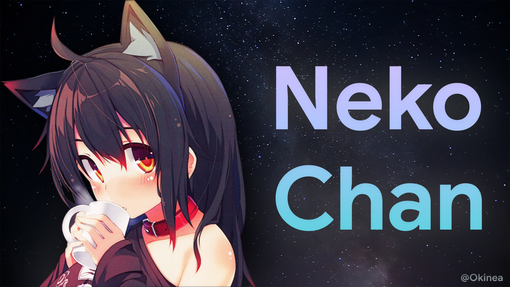
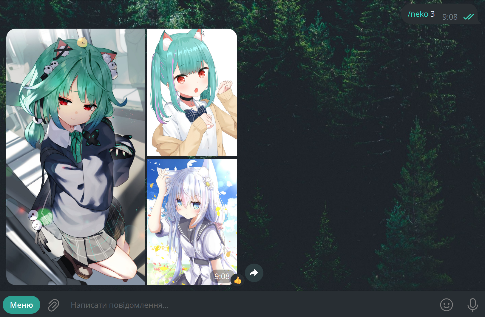

<a name="readme-top"></a>

<!-- PROJECT LOGO -->
<br />
<div align="center">
  <a href="https://github.com/okineadev/neko-chan-bot">
    
  </a>

<h3 align="center">😺 NekoChan</h3>

  <p align="center">
    A Telegram bot with cute cat girls (and not only) 😊
    <br />
    <a href="https://github.com/okineadev/neko-chan-bot/issues">Report Bug</a>
    ·
    <a href="https://github.com/okineadev/neko-chan-bot/issues">Request Feature</a>
  </p>
</div>

<!-- ABOUT THE PROJECT -->

## ℹ️ About The Project
****
</img>

This bot can send pictures and GIF's with nekos, kitsune .etc

This project uses [**nekosbest**](https://github.com/nekos-best/nekos-best.py) API

<hr>

<!-- GETTING STARTED -->

## 🧧 Getting Started

### 📦 Prerequisites

This is an example of how to list things you need to use the software and how to install them.

- **Git**
- **make** (in Linux)
- **Bash** or **cygwin-like** shell (in Windows)

### 💿 Installation


1. Clone the repo
   ```sh
   git clone https://github.com/okineadev/neko-chan-bot.git
   cd neko-chan-bot
   ```
2. Install all dependencies
   ```sh
   make setup
   # Or run this script if you on Windows
   # ./setup.sh
   ```
3. Create a bot in [@BotFather](https://t.me/botfather) and copy the token.

> If you don't know how to do it, here are the [**instructions**](https://telegra.ph/How-to-create-a-Telegram-bot-with-BotFather-02-08)

4. Add your bot's token to the `.env` (environment) file
   ```sh
   echo 'BOT_TOKEN="<your bot token>"' >> .env
   ```

<p align="right">(<a href="#readme-top">back to top</a>)</p>

<!-- USAGE EXAMPLES -->

## 🔥 Usage

Write a command to the bot with the category of photo or gif you want to receive

Usage: `/<category> <amount>`

Example: `/neko`

The bot will send you one photo of a kitten, to get several at the same time, write the number you want to get at the end: `/neko 8`

> [!NOTE]
> Note that the maximum number of photos at a time is 10 pieces.

You can also get a GIF by doing the same thing as in the previous step.

> [!NOTE]
> Note that you can only get one GIF at a time

<hr>

If you want to check out all the commands, here is their list:

<details>
  <summary><b>View full list</b></summary>
  <ul>
    <li><b>neko</b> - Send neko 😺</li>
    <li><b>kitsune</b> - Send kitsune 🦊</li>
    <li><b>waifu</b> - Send waifu 👩‍❤️‍👨</li>
    <li><b>husbando</b> - Send husbando 👨‍❤️‍👨</li>
    <li><b>baka</b> - Send baka GIF 🤦‍♂️</li>
    <li><b>bite</b> - Send bite GIF 👄</li>
    <li><b>blush</b> - Send blush GIF ☺️</li>
    <li><b>bored</b> - Send bored GIF 😑</li>
    <li><b>cry</b> - Send cry GIF 😢</li>
    <li><b>cuddle</b> - Send cuddle GIF 🤗</li>
    <li><b>dance</b> - Send dance GIF 💃</li>
    <li><b>facepalm</b> - Send facepalm GIF 🤦‍♂️</li>
    <li><b>feed</b> - Send feed GIF 🍽️</li>
    <li><b>handhold</b> - Send handhold GIF 🤝</li>
    <li><b>handshake</b> - Send handshake GIF 🤝</li>
    <li><b>happy</b> - Send happy GIF 😄</li>
    <li><b>highfive</b> - Send highfive GIF 🙌</li>
    <li><b>hug</b> - Send hug GIF 🤗</li>
    <li><b>kick</b> - Send kick GIF 👟</li>
    <li><b>kiss</b> - Send kiss GIF 💋</li>
    <li><b>laugh</b> - Send laugh GIF 😂</li>
    <li><b>lurk</b> - Send lurk GIF 🕵️‍♂️</li>
    <li><b>nod</b> - Send nod GIF 👍</li>
    <li><b>nom</b> - Send nom GIF 😋</li>
    <li><b>nope</b> - Send nope GIF 🙅‍♂️</li>
    <li><b>pat</b> - Send pat GIF 🤚</li>
    <li><b>peck</b> - Send peck GIF 💏</li>
    <li><b>poke</b> - Send poke GIF 👉</li>
    <li><b>pout</b> - Send pout GIF 😡</li>
    <li><b>punch</b> - Send punch GIF 👊</li>
    <li><b>shoot</b> - Send shoot GIF 🔫</li>
    <li><b>shrug</b> - Send shrug GIF 🤷‍♂️</li>
    <li><b>slap</b> - Send slap GIF 👋</li>
    <li><b>sleep</b> - Send sleep GIF 😴</li>
    <li><b>smile</b> - Send smile GIF 😊</li>
    <li><b>smug</b> - Send smug GIF 😏</li>
    <li><b>stare</b> - Send stare GIF 👀</li>
    <li><b>think</b> - Send think GIF 🤔</li>
    <li><b>thumbsup</b> - Send thumbsup GIF 👍</li>
    <li><b>tickle</b> - Send tickle GIF 🤣</li>
    <li><b>wave</b> - Send wave GIF 👋</li>
    <li><b>wink</b> - Send wink GIF 😉</li>
    <li><b>yawn</b> - Send yawn GIF 😪</li>
    <li><b>yeet</b> - Send yeet GIF 💨</li>
  </ul>
</details>

<p align="right">(<a href="#readme-top">back to top</a>)</p>

## 📑 Additional materials

### 🏞️ Photoshop designs

You can use and edit the `.psd` files located in the [**assets/photoshop**](assets/photoshop) folder

If you want to fix the logo of the repository, the avatar of the bot -you can safely take the file and edit it, after that export the photo and place it in the desired folder (for example [**public**](public))

### 📄 Commands

A list of all commands is in the file [**commands_list.txt**](assets/commands_list.txt)
You can send it to BotFather to install a menu with all the commands

<!-- CONTRIBUTING -->

## 🤝 Contributing

Contributions are what make the open source community such an amazing place to learn, inspire, and create. Any contributions you make are **greatly appreciated**.

If you have a suggestion that would make this better, please fork the repo and create a pull request. You can also simply open an issue with the tag "enhancement".
Don't forget to give the project a star! Thanks again!

1. Fork the Project
2. Create your Feature Branch (`git checkout -b feature/AmazingFeature`)
3. Commit your Changes (`git commit -m 'Add some AmazingFeature'`)
4. Push to the Branch (`git push origin feature/AmazingFeature`)
5. Open a Pull Request

<!-- LICENSE -->

## 📝 License

Distributed under the GNU GPLv3 . See `LICENSE.txt` for more information.

<!-- CONTACT -->

## ☎️ Contact

Telegram - [**@Okinea**](https://t.me/okinea)

If you have any suggestions or problems, contact me.

## 🍩 Support
You can support me financially, I will be very grateful!

💳 **Bank card:** `4441 1144 0274 7206` (**monobank**)

💎 **TON Wallet:** `UQBaBIBtKJpdwc4jKSGd70LZyQnEf-Nx5edzZlZAAGkHnZ7E`

</br>

<a href="https://www.buymeacoffee.com/okinea" target="_blank"></a>
